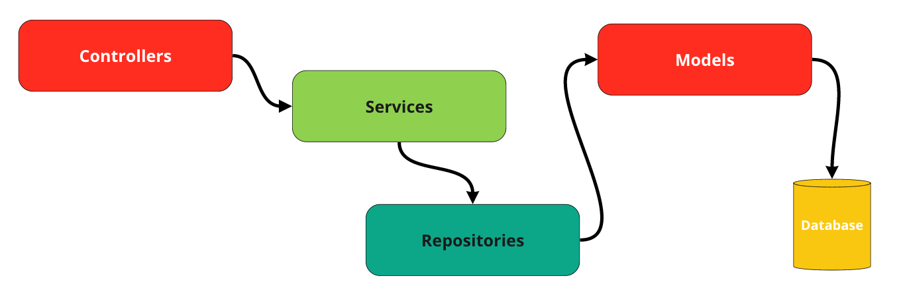
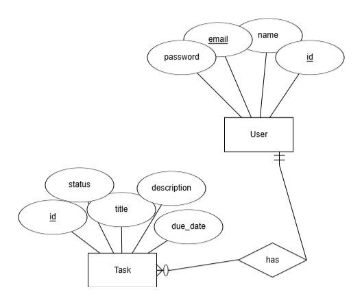

# Task Management System

A simple and efficient task management system built with Laravel, following the Service-Oriented Architecture (SOA) combined with Laravel's default Model-View-Controller (MVC) structure.

---

## Architecture

This project employs the **Service-Oriented Architecture (SOA)** alongside Laravel's **Model-View-Controller (MVC)**. The architecture is organized into two key components:

- **Services**: Responsible for handling business logic.
- **Repositories**: Manage communication with data sources.

This structure provides semantic separation of concerns, improves modularity, and facilitates clear communication between components.



---

## Database Schema

The database schema consists of two simple tables:

- **Users Table**: Contains user-related data.
- **Tasks Table**: Stores task details and their association with users.



---

## Project Structure

The project is structured as follows for better organization and scalability:

```markdown
task-management/
├── app/
│   ├── Classes/
│   │   └── Api/
│   │       ├── ApiResponse.php
│   │       └── ApiResponseInterface.php
│   ├── Exceptions/
│   │   └── Api/
│   │       └── ApiBaseException.php
│   ├── Http/
│   │   ├── Controllers/
│   │   │   └── Api/
│   │   │       ├── TaskController.php
│   │   │       └── UserController.php
│   │   ├── Resources/
│   │   │   └── Api/
│   │   │       ├── PaginationResource.php
│   │   │       └── TaskResource.php
│   ├── Repositories/
│   │   └── TaskRepositoryInterface.php
│   ├── Services/
│   │   └── TaskService.php
│   ├── Traits/
│   │   └── ManageUserTokens.php
│   └── User.php
├── bootstrap/
│   └── app.php
├── composer.json
├── composer.lock
├── config/
│   ├── app.php
│   ├── filesystems.php
│   ├── logging.php
│   ├── services.php
│   └── session.php
├── database/
│   ├── factories/
│   ├── migrations/
│   ├── seeders/
│   └── seeds/
├── package.json
├── public/
│   ├── index.php
│   └── storage/
├── resources/
│   ├── js/
│   │   └── app.js
│   └── views/
├── routes/
│   ├── api.php
│   └── v1/
│       └── api.tasks.php
├── storage/
│   ├── app/
│   │   ├── private/
│   │   └── public/
│   └── logs/
├── tests/
│   ├── Feature/
│   │   └── ExampleTest.php
│   ├── Unit/
│   │   └── ExampleTest.php
│   └── TestCase.php
├── vendor/
└── .env
```

## Installation Guide

Follow the steps below to set up the project:

### Clone the Repository
```bash
git clone https://github.com/kareemshaaban221/task-management.git
cd task-management
```

### Configure Environment
```bash
cp .env.example .env
```

Ensure you create a database named `task_management` and update the `.env` file with your database credentials.

### Install Dependencies
```bash
composer install
```

### Generate Encryption Key
```bash
php artisan key:generate
```

---

## Migrations Setup

To set up the database schema, start by running the migrations with the following command:
```bash
php artisan migrate
```

If you have already migrated the database and need to reset it, you can use the following command to fresh-migrate the schema:
```bash
php artisan migrate:fresh
```

To populate your database with sample data, run the seeders using:
```bash
php artisan db:seed
```

For convenience, you can run both migrations and seeders together, ensuring your database is fully set up with one command:
```bash
php artisan migrate:fresh --seed
```

---

## Queue Setup

The system uses queues for notifications. Start the queue worker to handle notifications:

```bash
php artisan queue:work
```

---

## Task Scheduling

Notifications are sent daily to users whose tasks exceed a specified amount of time. The notification logic is implemented in the `TasksReminderCommand.php` file. To run the scheduler:

```
php artisan schedule:run
```

---

## Mail Setup

To configure the email settings for the task reminder notifications, follow these steps:

1. Open the file `TaskReminderNotification.php`. You can access it directly [here](./app/Notifications/TaskReminderNotification.php#L73).
2. Locate the `buildMailer` method within the file.
3. Update the email and password credentials in the method to match your mail service configuration.

### Note:
There is currently an issue with Laravel 11.x where the `.env` file configurations for mail may not apply correctly. This requires a manual override within the code. Ensure your credentials are secure and avoid hardcoding them in production environments where possible. If you encounter further issues, consult the Laravel documentation or community forums for troubleshooting assistance.

---

## Testing

Comming soon

---

## API Documentation

The API documentation is available through Postman. You can access the full documentation by following this [link](https://documenter.getpostman.com/view/18140965/2sAYBYepZe).

---

## Future Work

Due to time constraints, unit and feature tests have not been implemented yet. However, I plan to incorporate them in the near future to ensure the reliability and stability of the application.

---

Feel free to adjust or add more details based on your specific project requirements.

